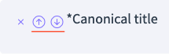
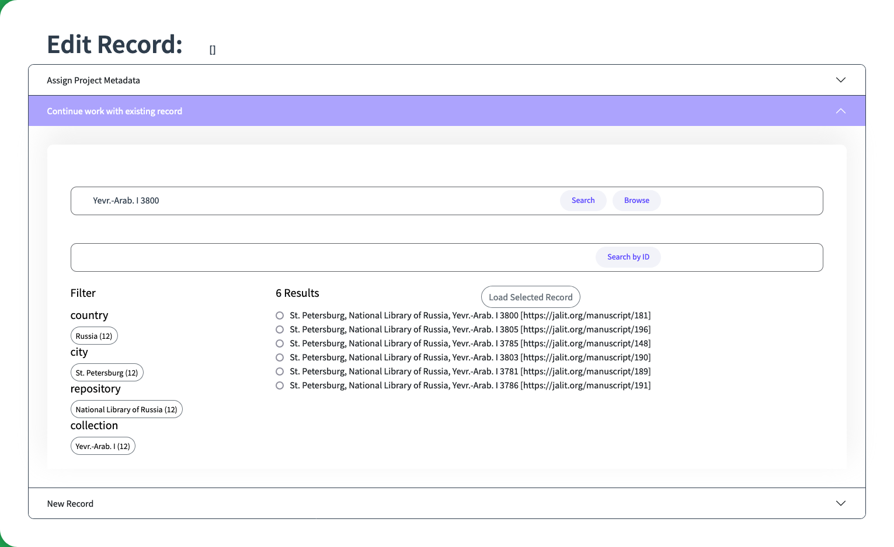
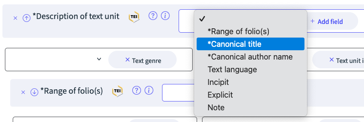

# manuForma User Handbook

## Version 1.0.0

## Maximilian de Molière

## manuForma has been implemented by Winona Salesky and Maximilian de Molière

[**Introduction	2**](#introduction)

[What manuForma does	2](#what-manuforma-does)

[What this Handbook does	2](#what-this-handbook-does)

[**Creating an Account	2**](#creating-an-account)

[**Logging in	3**](#logging-in)

[**Managing Records	4**](#managing-records)

[A. Opening Records from the Database	5](#opening-records-from-the-database)

[B. Creating New Records	5](#b.-creating-new-records)

[C. Uploading Records from your Computer	6](#c.-uploading-records-from-your-computer)

[**Saving Records	7**](#saving-records)

[**Edit Records	8**](#edit-records)

[Subsections	8](#subsections)

[Create collapsibles	8](#create-collapsibles)

[Move collapsibles	9](#move-collapsibles)

[Delete collapsibles	9](#delete-collapsibles)

[Fields	10](#fields)

[Create Fields	10](#create-fields)

[Move Fields	11](#move-fields)

[Delete Fields	11](#delete-fields)

[Features	11](#features)

[Create Features	11](#create-features)

[Delete Features	11](#delete-features)

[Add References to Other Records	12](#add-references-to-other-records)

[Create Relationships between Records	12](#create-relationships-between-records)

[Edit Transcriptions, Translations and Descriptive Texts	12](#edit-transcriptions,-translations-and-descriptive-texts)

[Paragraphs	13](#paragraphs)

[Linebreaks	13](#linebreaks)

[Italic text	13](#italic-text)

[**Extending an existing record for another project	14**](#extending-an-existing-record-for-another-project)

# Introduction {#introduction}

## What manuForma does {#what-manuforma-does}

manuForma is a tool that allows you to create TEI-XML files of manuscripts and other related entities inside your browser without the need of external programs like OxygenXML. You can submit the files to a GitHub repository or save them on your local hard drive. Whenever you want to continue working on your records, you can again load them into manuForma. It also allows you to reference different records to model dependencies between them, such as persons who are referenced as authors in work records. And you can even express complex relationships between your records.

## What this Handbook does {#what-this-handbook-does}

This handbook will introduce you to the functionalities of *manuForma*. You will learn how to create records, how to load existing records, how you can edit them and how to create references between them. In other words, this handbook is concerned with the technical side of TEI records. You will not learn how to describe manuscripts from a paleographic point of view. We assume that you already know these things. manuForma provides explanations about the intended usage of the fields when you hover your mouse over the “?” button next to the field’s name.

# Creating an Account {#creating-an-account}

1. On the start page, click the button in the upper right corner. The login screen will open.   
2. Click on “Create New User”.  
3. Your user name should consist of the first letter of your firstname and your lastname. No caps, no spaces. E.g., the user name for “Max Mustermann” is “mmustermann”.  
4. Fill in the remaining fields and click “Create Account”.   
5. You can now log in to manuForma.[^1]  
   

# Logging in {#logging-in}

1. On the start page, click the button in the upper right corner. The login screen will open.   
2. Enter your user name and password.  
3. Click “Login”.

# Managing Records {#managing-records}

On the entry page select the kind of entity for you want to work with. As of now, manuForma supports manuscripts, persons, places, works, and relationships. Creating, opening, and submitting records works the same for all entities.

1. ## Opening Records from the Database {#opening-records-from-the-database}

1. manuForma will open the main page view where you can search for previously created records and create new records.  
2. Click on the collapsible titled “Continue with existing record”.  
   1. You can browse the list of records available in the database by clicking “Browse”.  
   2. Enter a filename under the header “Search” and click “Search” to look for a specific record.   

3. If you the internal identifier for the record, you can search for it by entering it into the field “Search by ID” and clicking it.
  
 

3. Click “Load selected record” and the record will be loaded into manuForma.

## B. Creating New Records {#b.-creating-new-records}

1. manuForma will open the main page view where you can create new records and search for previously created records.  
2. Open the list under the header “New Record”  and select the “Manuscript template” from the selection pane. Click the button “Load Template File”.

3. On the top of the screen, click on the option “Admin Metadata”.  
4. In the upper right corner click the button “Submit to GitHub” to save the record to your GitHub repository.  
5. You can also send the record directly to your application by clicking “Submit to Github”. Enter a one-sentence description of your work. In this case, we suggest “Created record from own observations.” or “ “Created record from catalog description.”  
6. Click “Save”.   
7. Congratulations\! You created your first record with manuForma.

## C. Uploading Records from your Computer {#c.-uploading-records-from-your-computer}

1. On the entry page select the kind of entity for which you want to open. As of now, manuForma supports manuscripts, persons, places, and titles.  
2. manuForma will open the main page view where you can search for previously created records and create new records.  
3. Under the header “Upload”, click “Browse”.  
4. You can then select a file from your computer.  
5. Click “Load” to upload the file to manuForma.  
6. If the file is compatible with the schema, you can edit it with this configuration of manuForma.  
7. In order to save the file to GitHub or your database, proceed from step 4 in “Creating New Records”.

# Saving Records {#saving-records}

Once you have completed your work on the record, you need to *submit* it to the Github repository, which is the equivalent to saving it. **Changes are not automatically saved in manuForma\!**

1. Click on “Submit to Github”.  
 
2. Write short summary of the changes you made to the record. Here are some suggestions:

   “Linked to work/person records.”

   “Added incoded document/heritage data.”

   “Added bibliographic items.”

   “Added codicological observations from the original manuscript.” / “Added codicological observations from a catalog.” 

3. Click “Save”.  
4. Go the Github repository and select “Pull requests” from the horizontal menu at the top of the page.  
     
     
5. Select the pull request whose ID matches the record you just submitted to Github.  
6. You can examine the TEI code by clicking on “Files changed”.  
7. If everything is in order and Github indicates that there are no problems with the record, click “Merge pull request”.  
8. Your record is now saved to the repository.  
 
   

**⁉️ Sometimes GitHub will display a Merge Error when the newly made changes are in conflict with another submission. Only try to solve these kinds of errors if you know what you are doing\! Otherwise contact the project’s DH specialist\!** 

# Edit Records {#edit-records}

## Subsections {#subsections}

To enter data, select one of the subsections on the left side of the application. Each subsection is subdivided into collapsibles that aggregate the data into smaller parts. The headlines of collapsibles summarize the kinds of data that can be entered. Sometimes these headlines change when data have already been entered, summarizing the main points.

The largest units you can edit in manuForma are collapsibles–units containing several fields and features. Together they often comprise complex items such as bibliographic entries. 

### Create collapsibles {#create-collapsibles}

To create a new collapsible, open one of the existing collapsibles in the document and select the first grey button starting with a plus sign and then a description of its contents. For example:

### Move collapsibles {#move-collapsibles}

To reorder a sequence of collapsibles, open the collapsible in question and select the down or up arrow of the top most field.

### Delete collapsibles {#delete-collapsibles}

To delete a collapsible, open the collapsible in question and select the X button of the top most field.

## Fields {#fields}

Fields are the main components that you will interact with in manuForma. They are usually blank fields into which you enter text. Others offer dropdown menus with options to choose from, allowing us to maintain consistent in our terminology. And some fields are filled out automatically when linking records like persons, works, etc.

**💡** Because there can be dozens of different fields in large records like manuscripts, manuForma offers concise help texts. They may be found to the right of the field name, mouse over the question mark to activate it.

**💡** The MAJLIS team is using domain-specific vocabulary to describe bibliographic, codicological, paleographic and other phenomena. This allows our team to use manuForma more efficiently without the need to learn how they are called in TEI. In case you do want to know the field’s original name in TEI, mouse over the TEI symbol to the right of the field name.

The templates for the different entity types are equipped with many fields for you to fill in. However, it may be necessary to create, delete, or move fields to fit the needs of your entry. 

### Create Fields  {#create-fields}

To create a new field, go the field containing (it may take little while to find the correct field) and open the dropdown list. Select the desired field. Click “Add field”.

### Move Fields {#move-fields}

To reorder a sequence of fields, select the down or up arrow of the field.  

### Delete Fields {#delete-fields}

To delete a field, click the X button of the field.

## Features {#features}

Features provide additional information to fields. You never have to enter text into features, as they usually offer dropdown menus with options to choose from. Other features are filled out automatically when linking records like persons, works, etc.

### Create Features {#create-features}

To create a new feature, go the field containing (it may take little while to find the correct field) and open the dropdown list. Select the desired feature. Click “Add feature”.  

### Delete Features {#delete-features}

To delete a feature, click on the X next to the feature’s name.

## Add References to Other Records {#add-references-to-other-records}

At the moment you can add references to the following elements: placeName, author, personName, and title. The process of referencing them is the same for all of them:  
1\. Go to an element that supports references or create one.  
2\. In the same row as the element name, click the option “Look up”.  
3\. A small window opens. Write the name of the record into the search bar and press the magnifying glass button.  
4\. Choose an entry from the list of results and click “Add to Record”. Then close the window.  
5\. The name of the record has been copied into the element and the URI has been added to the ref attribute.

**💡** If the record you want to reference does not exist yet, you can create one on the spot. Click the “New person name” / “New place name” / “New title name” button. And you will be directed to the correct form. **Note that you have to submit and merge the new record before you can find it in manuForma.**

## Create Relationships between Records {#create-relationships-between-records}

We use the same basic principles for creating relationships that we already know from the section on references–the main difference is that several records are looked up.

1. Create a Relation element. It should contain most of the fields you need–but when dealing with groups of people or items you may need to create additional fields.  
2. In the field “Description of relation” select an option from “Choose the type”. If the relationship contains in its description \[Subject\] and \[Object\], proceed with a). If it contains \[Mutual\], proceed with b).  
   1. In the relation “Abraham is the father of Yahya” the person entry of Abraham is the subject and the entry of Yahya is the object of the statement. The relationship is calling for the fields “Subject of relation” for Abraham and “Object of relation” for Yahya. Look up the identifier for both fields as described above in the section “Add References to Other Records”.  
   2. In the relation “Yefet and David corresponded with each other” both persons are mutuals of the statement. The relationship is therefore calling for the field “Mutual relation” for both Yefet and David. Look up the identifier for both fields as described above in the section “Add References to Other Records”.

## Edit Transcriptions, Translations and Descriptive Texts {#edit-transcriptions,-translations-and-descriptive-texts}

**manuForma does not offer a fully fledged text editor\!** Instead, users can enter markup like italic text in selected fields using a number of special characters, or *Markdown*.[^2] 

**💡** The technology behind manuForma, XForms, does not allow us to create rich text fields that we know from other software. For this reason we had to come up with this workaround. manuForma will convert the markdown characters into the proper TEI tags when submitting the file to GitHub, creating valid TEI. Whenever a record is loaded into manuForma, the TEI commands are replaced with markdown and you can continue to edit the texts.

So far, users can add the following text markup:

### Paragraphs  {#paragraphs}

To create paragraphs, use a blank line to separate one or more lines of text.

| Markdown | TEI | Rendered Output |
| ----- | ----- | ----- |
| `I really like using Markdown. I think I'll use it to format all of my documents from now on.` | `
I really like using Markdown.
 
I think I'll use it to format all of my documents from now on.
` | I really like using Markdown. I think I'll use it to format all of my documents from now on. |

### 

### Linebreaks {#linebreaks}

To create a line break or new line, end a line with two or more spaces, and then type return.

| Markdown | TEI | Rendered Output |
| ----- | ----- | ----- |
| `This is the first line.   And this is the second line.` | `
This is the first line.<lb/> And this is the second line.
` | This is the first line. And this is the second line. |

### Italic text  {#italic-text}

To italicize text, add one asterisk before and after a word or phrase.[^3] 

| Markdown | TEI | Rendered Output |
| ----- | ----- | ----- |
| `Italicized text is the *cat's meow*.` | `Italicized text is the <emph>cat's meow</emph>.` | Italicized text is the *cat’s meow*. |

# Extending an existing record for another project {#extending-an-existing-record-for-another-project}

Reusing TEI records from other projects is a complex process that cannot only be performed in manuForma. The most important prerequisite is to align the legacy data with the TEI schema used in manuForma – otherwise fields may not be displayed and new additions may not be reliably saved. 

**💡** If you are dealing with a large number of records you may want to add the project metadata of your research project to all files in Oxygen XML or another XML processor for convenience.

In manuForma you can add the project metadata of your research project to individual records in the main menu: 

1. Select the collapsible “Assign project metadata”.  
2. Choose the project from the list.  
3. Click “Load Project Metadata”.  
4. Proceed with editing or submitting the modified record, as described in other sections.

[^1]:  Your full name will only be displayed in JALit if it has been added to the list of editors in every record, otherwise only the the abbreviated form will be shown. Contact the project’s DH specialist if this happens.

[^2]:  See the documentation [https://www.markdownguide.org/basic-syntax/](https://www.markdownguide.org/basic-syntax/). Note that only a fraction of these commands is available in manuForma\!

[^3]:  If you want to write an asterisk as part of the text, add a backlash before it (\\\*).